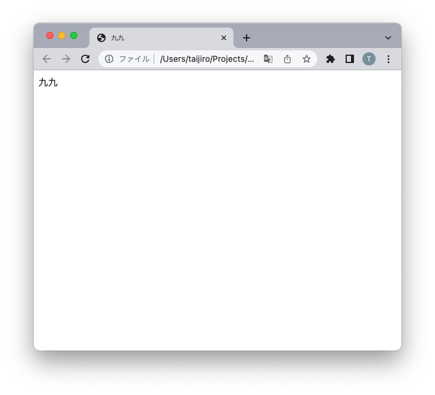
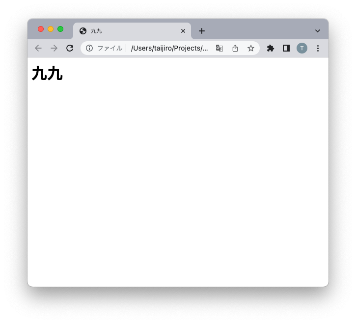
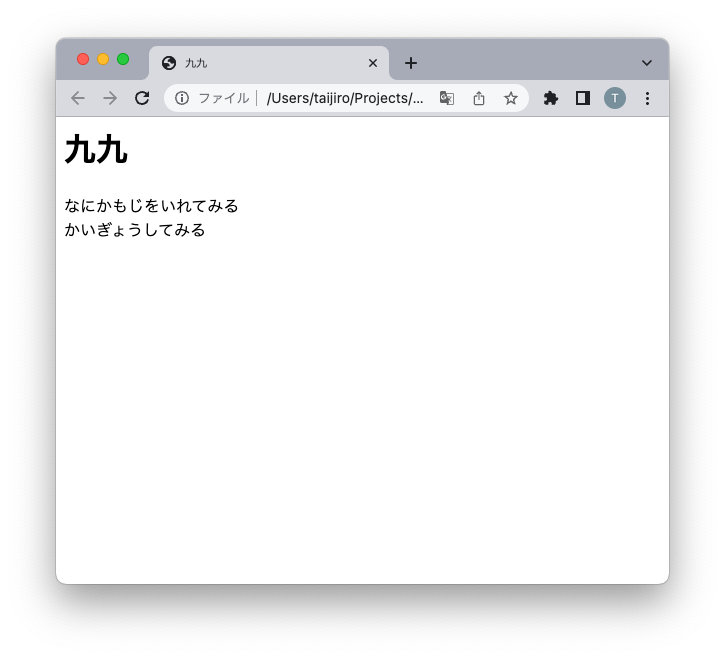
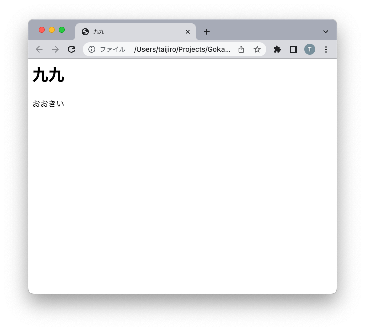
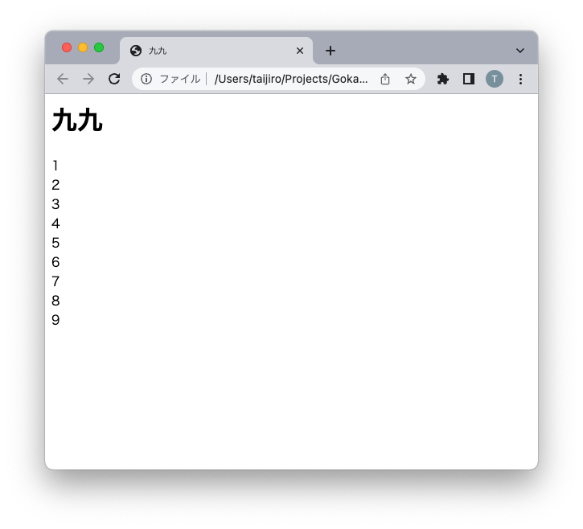
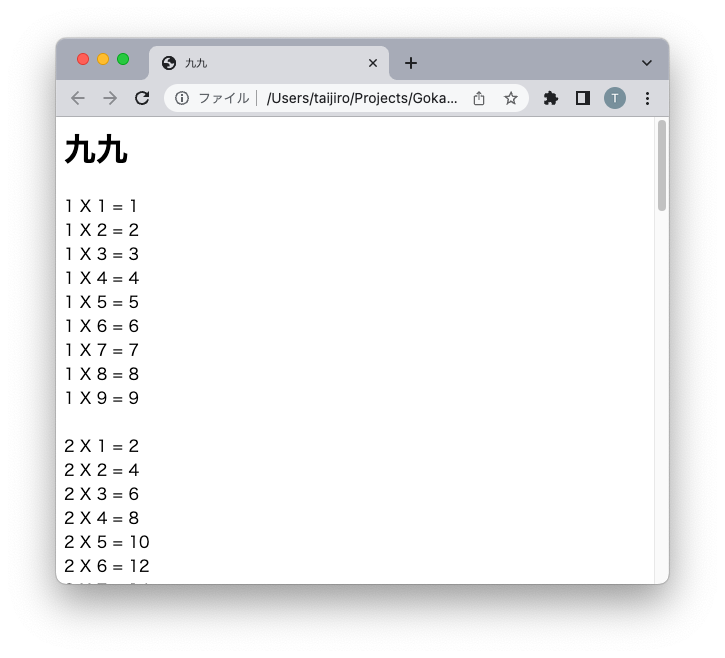

# WEBプログラミング教室 #1

## 「九九を全部ならべてみる」

---

javascriptという言語を使って、プログラムを書いてみます。
[JavaScript https://developer.mozilla.org/ja/docs/Web/JavaScript](https://developer.mozilla.org/ja/docs/Web/JavaScript)

---
## VisualStudioCode(VSCode) をインストール

・[VSCodeオンライン https://vscode.dev/ ](https://vscode.dev/)
・[VSCodeダウンロード https://code.visualstudio.com/download](https://code.visualstudio.com/download)

---
## パソコンの中身

### フォルダとファイル

### 拡張子

---
## HTMLを書いてみる
```
<html>
    <head>
        <title>九九</title>
    </head>
    <body>
        九九
    </body>
</html>
```
---


---
### HTMLの構成
* タグで囲まれている（開始タグと終了タグがある）
* <html>〜</html> で全体が囲まれている  
* <html>〜</html> の中に、<head>〜</head> と<body>〜</body> がある
*  <head>〜</head> 表示されない（設定情報など）
* <body>〜</body> 表示する内容
* 囲まないタグもある
* &lt;br&gt; 表示する内容

---
### HTMLのタグ

* <h1> 大見出し
* <h2> 中見出し
* <h3> 小見出し
..
* <h6> 
* &lt;br&gt; 改行

[HTMLタグ リファレンス https://www.htmq.com/html/indexm.shtml](https://www.htmq.com/html/indexm.shtml)

---
## 「九九」を大見出しにしてみる
```
<html>
    <head>
        <title>九九</title>
    </head>
    <body>
        <h1>九九</h1>
    </body>
</html>
```
---



---
## 文章をついかしてみよう
```
<html>
    <head>
        <title>九九</title>
    </head>
    <body>
        <h1>九九</h1>
        なにかもじをいれてみる<br>
        かいぎょうしてみる
    </body>
</html>
```
---


---
## HTMLの中にプログラムを書いてみる

```
<html>
    <head>
      <title>九九</title>
    </head>
    <body>
      <h1>九九</h1>
      <script>
          a = 4;
          b = 2;
          c = a + b;
          document.write(c);
      </script>
    </body>
</html>
```
---
## プログラムの解説

<script>〜</script>
の部分がプログラムです。
プログラムは上から順に1行ずつコンピューターが実行してくれます。
各行の終わりには ; をつけます。

変数 a と b と c があります。

変数は、数字とか文字を入れておくところです。
a = 4;
は、a という変数に 4 を入れる、という意味です。
b = 2;
は、b という変数に 2 を入れる、という意味です。

---

c = a + b;
は、c という変数に、 a + b を入れるという意味です。

a には 4、 b には 2 が、すでに入っているので
c には、6 が入るはずです

document.write(c);
は、変数 c を画面に表示するという意味です。

---

コンピューターでは
足し算は +
引き算は -
掛け算は *
割り算は / 

---


---
## もしも if 

```
    <script>
        a = 1;
        b = 1;

        if ( a > 1 ) {
            document.write('おおきい');
        }
        if ( a > 5 ) {
            document.write('すごくおおきい');
        }
    </script>
```
---
## 解説

if は、もしも、() の中の条件が正しければ、{ と } の間のプログラムを実行します
そうでなければ{ と } の間のプログラムは飛ばされます。

なので、もし 変数 a が 1 より大きいと
document.write('おおきい');
を実行するので、画面に「おおきい」と表示されます

a を いろいろな数字に変えて、試してみましょう

---


---
## くりかえす while

```
    <script>
        a = 1;
        b = 1;
        while(a < 10) {
          document.write(a);
          document.write('<br>');
          a = a + 1;
        }
    </script>
```

---
## 解説

 while は、() の中の条件が正しければ、{ と } の間のプログラムをプログラムをくりかえし実行します
そうでなければ{ と } の間のプログラムは飛ばされます。

{ } の中で
a = a + 1 をしているので、
変数 a の中身は、1つずつ 増えていきます。

a が 10より小さい間だけ繰り返されます。

---



---
## 九九を表示する

while { } の内側に、
さらに while { } を書くことができます。
どうやったら、九九を表示できるでしょうか。

---

```
    <script>
        a = 1;
        while(a < 10) {
          b = 1;
          while(b < 10) {
            c = a * b;
            document.write(a);
            document.write(' X ');
            document.write(b);
            document.write(' = ');
            document.write(c);
            document.write(' <br> ');
            b = b + 1;
          }
          document.write(' <br> ');
          a = a + 1;
        }
    </script>
```
---



---
## おまけ
[Blockly https://blockly.games/](https://blockly.games/?lang=ja)
Googleがつくったブロックでならべるプログラムの学習
「迷路」をやってみると面白いです